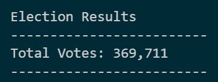
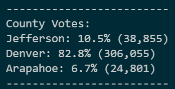
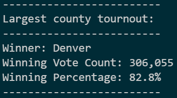
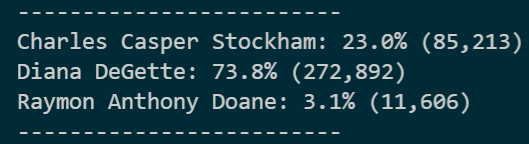
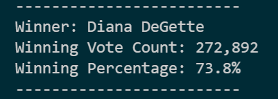

# ** ELECTION ANALYSIS**

## Overview of Election Audit

-The purpose of this project it apply all rhat we learned in the module 3 in the Data analysis and visualization  Boot camp of the University of Texas at Austin.
During the this module we had the oportunity to learn the programming language Python
Durng the challege we worked with data of an the election of and we had the votes of 3 counties:

Jefferson
Denver
Arapahoe

We had 3 candidates:

	Charles Casper
	Diana DeGette
	Raymon Anthony

	

## Election-Audit Results

- The macro we developed creates a table of the 12 different tickers where we can see data such as: Total Daily Volume, and the return of investment  either in 2017 or 2018
- 
### How many votes were cast in this congressional election?

This election had 369,711 votes

- 

### Provide a breakdown of the number of votes and the percentage of total votes for each county in the precinct.

- 

### Which county had the largest number of votes?

- 
###Provide a breakdown of the number of votes and the percentage of the total votes each candidate received.

- 

###Which candidate won the election, what was their vote count, and what was their percentage of the total votes?

- 

## Election-Audit Summary
-	
-	###We can see the data is very powerful and I’d like to add two more pieces of infarmation that could used in other elections

-	1.  The data cab be multi-grouped where in the firs level  is the county and in the second is the candidate. We would be able to see who won in each county.

-	- 
-	
-	2.  The data can oslo be shown grouped mainly by candidate and then by county. In this way, we could see where each candidate had better results
-	
-	- 

In summary, we can say Denver is the key element for this election, This County has 82% of the votes 

